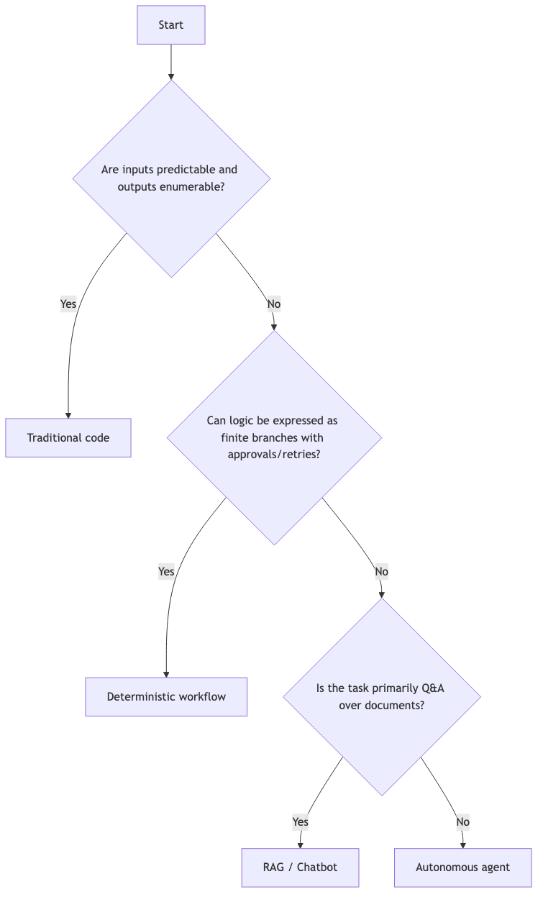
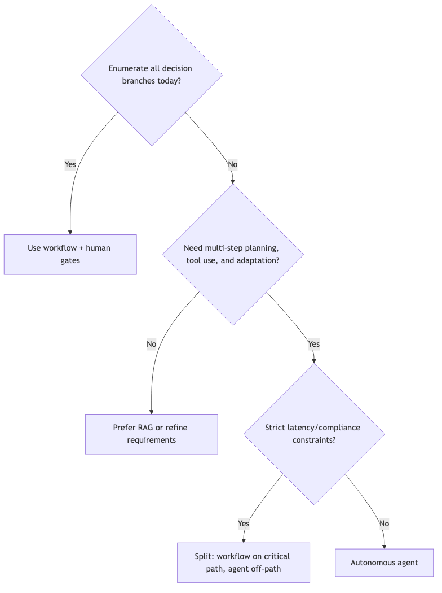

## Agents vs. Workflows: How to Choose the Right Approach

Selecting between traditional code, deterministic workflows, RAG/chatbots, and autonomous agents determines whether your system is elegantly simple or an overengineered maintenance burden. The right choice depends on four dimensions: input variability, reasoning complexity, performance/compliance constraints, and lifecycle/maintenance cost.

### When to use traditional code (no ML at all)

If inputs are fully predictable and outputs can be exhaustively specified, conventional procedural code is faster, cheaper, and simpler to test than any ML pipeline. Examples:

- Log parsing with a fixed schema (e.g., YYYY-MM-DD HH:MM:SS—message)
- Embedded systems requiring millisecond latency
- Deterministic control loops in regulated contexts (medical, avionics, trading controls)

Why it fits:

- Maximum explainability and auditability
- Lowest operational cost and latency
- Deterministic behavior essential for certification and safety

### When to use deterministic workflows

Choose a workflow when logic can be expressed as a finite set of steps/branches and you know where human approvals, retries, or compensations are needed. Examples:

- Invoice ingestion from a few known vendors (CSV/JSON/PDF routing + reconciliation)
- ETL pipelines with retries, backoff, and manual review steps
- Back-office processes needing auditable checkpoints and SLAs

Why it fits:

- Clear control over error paths and side effects
- Easy to insert human-in-the-loop gates
- Scales better than ad hoc scripts without adding LLM complexity

### When to use chatbots/RAG (but not agents)

RAG and classic chatbots excel at question-answering over corpora, with limited orchestration. Examples:

- Internal IT help desk answering “How do I reset my VPN?” from docs
- Customer self-service over product manuals and policies
- Knowledge discovery across wikis and PDFs

Why it fits:

- Adds semantic search and natural language interfaces
- Lower cost and simpler governance than agents
- Primary overhead is keeping embeddings and content fresh

### When to use autonomous agents

Agents shine when inputs are unstructured/novel and you need dynamic, multi-step planning, parallel task execution, or continuous learning from feedback. Examples:

- Customer support triage across open-ended emails and chats with escalation logic
- Supply chain replanning based on live signals (inventory, lead times, disruptions)
- Security operations executing parallel enrichment, log queries, and sandboxing

Why it fits:

- Asynchronous, context-aware planning across multiple tools/APIs
- Ability to reprioritize in real time based on evolving signals
- Justifies higher compute and governance costs through adaptability and coverage

### Decision factors

Evaluate across these axes before you choose:

- Input variability: fixed schemas → code; few known formats → workflow; broad/unstructured → agent
- Reasoning complexity: simple rules → code/workflow; multi-step with uncertainty → agent
- Performance/latency: strict SLOs favor code/workflow; agents add overhead
- Compliance/explainability: workflows give step-by-step audit; agents need extra tracing/guardrails
- Maintenance: agents require prompt/tool governance and drift management; RAG requires content hygiene

### Visual decision flowcharts

#### High-level selector

#### Workflow vs. Agent quick check

### Expanded comparison

| Characteristic        | Traditional code            | Workflow                          | RAG/Chatbot                         | Autonomous agent                          |
|-----------------------|-----------------------------|-----------------------------------|-------------------------------------|-------------------------------------------|
| Input structure       | Fully predictable           | Mostly predictable, finite branches | Semi-structured over documents      | Highly unstructured/novel                 |
| Primary capability    | Deterministic transforms    | Orchestrated steps with gates     | Natural language Q&A over corpora   | Goal-driven planning + action             |
| Explainability        | Full transparency           | Branch-by-branch audit trail      | Traceable retrievals and prompts    | Needs traces, tool logs, policy checks    |
| Latency               | Ultra-low                   | Low–moderate                      | Moderate                            | Moderate–high                             |
| Adaptability          | None                        | Low (configurable branches)       | Medium (content changes help)       | High (feedback and tools change behavior) |
| Operational cost      | Lowest                      | Low                               | Medium                              | Highest                                   |
| Typical failures      | Unhandled edge case         | Unhandled branch/state            | Hallucinated answer if content stale | Tool misuse, loops, or drift             |
| Governance needs      | Basic code review           | Runbooks and approvals            | Content/prompt hygiene              | Safety policies, evals, sandboxing, rate limits |

### Architecture and governance implications

- Observability: Agents require telemetry across prompts, tools, states, and outcomes; workflows rely on step logs and metrics; RAG benefits from retrieval transparency (what was fetched and why).
- Safety and guardrails: Agents need policy checks (PII, jailbreak, tool call limits), runtime constraints (max steps/time), and deterministic fallbacks for critical paths.
- Testing strategy: Code/workflows are unit/integration-test centric; RAG/agents need scenario/e2e evaluations, red-teaming, and regression suites over prompts/tools.
- Change management: For RAG, update content and re-embed; for agents, changes may involve tools, policies, memory, and planning parameters.

### Cost and performance considerations

- LLM calls dominate agent costs; reduce via caching, smaller models for routing, and truncation.
- Latency compounds across planning → tool calls → verification; add parallelism and short-circuit paths.
- Workflows can pre-filter/rule out cases before invoking an agent (“agent last” pattern) to save cost.

### Implementation patterns

- Workflow-first, agent-assisted: Use workflows for the happy path and invoke an agent for exceptions/long tail.
- Agent-with-tools: Constrain agents to approved tools with clearly typed inputs/outputs; log every call.
- RAG + agent: Use RAG to ground agent reasoning and minimize hallucinations before acting.
- Human-in-the-loop: Insert approval gates for high-risk actions; require evidence bundles generated by the agent.

### Illustrative scenarios

- Log parsing with fixed schema → Write deterministic code.
- Vendor invoices in three known formats → Use a workflow with retries and manual review.
- Enterprise knowledge Q&A → Deploy a RAG system; govern content freshness.
- Open-ended customer triage with refunds/escalations → Use an agent with tools and guardrails.
- SOC alert triage requiring parallel enrichment and containment → Use an agent with strict policies and audit.

### Checklist before choosing

- Can you enumerate all inputs and branches today? If yes, prefer code/workflow.
- Is the task primarily retrieving and summarizing known content? If yes, prefer RAG.
- Do you need multi-step planning, tool use, and adaptation to intermediate results? If yes, consider an agent.
- Are compliance, latency, or cost constraints incompatible with LLM calls? If yes, avoid agents on the critical path.

### Bottom line

If your task is a fixed, deterministic transformation, write simple code. If there are a handful of known branches and you need explicit error-handling checkpoints, choose a deterministic workflow. If you primarily need natural language question-answering over a corpus, use a RAG architecture. But if you face high variability, open-ended reasoning, dynamic planning needs, or continual learning requirements, invest in an autonomous agent—while adding the governance, telemetry, and human oversight to keep it safe, reliable, and cost-effective.
